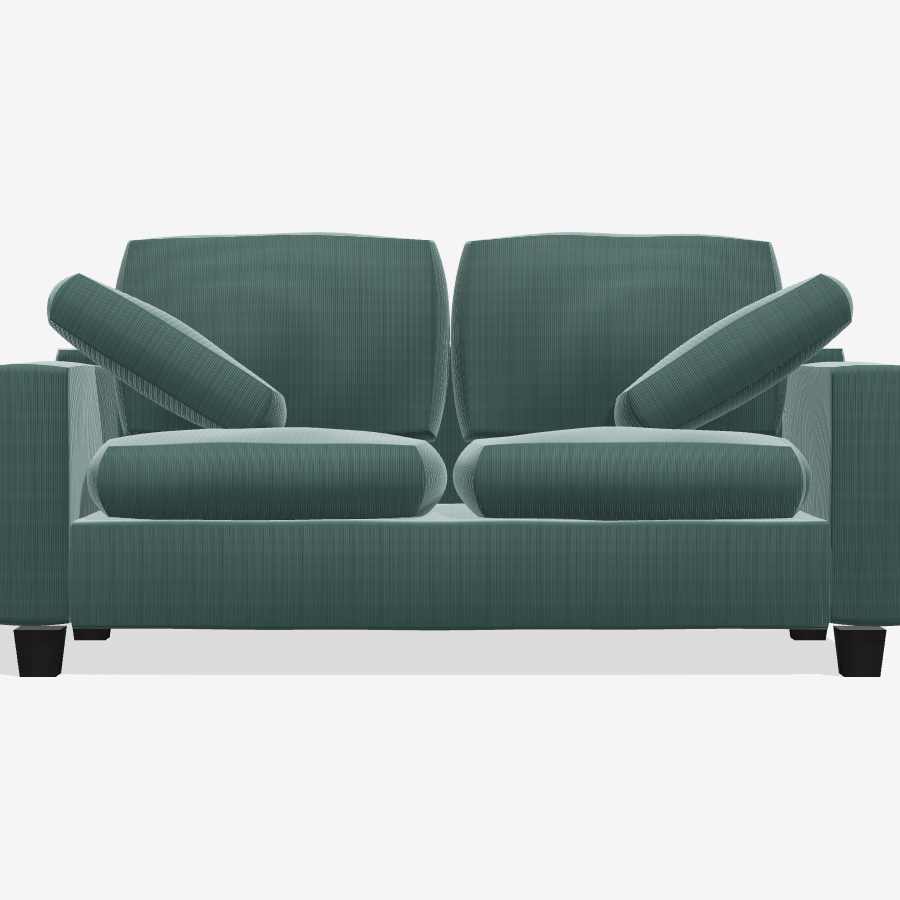

# コーデュロイソファ 3Dモデル

商品写真4枚(正面・斜め・側面・背面)を元に採寸・分析してモデリングした、
2人掛けコーデュロイソファの3Dデータ一式。



## ファイル構成

| ファイル | 内容 |
| --- | --- |
| `sofa.glb` | **3Dデータ本体**(glTF 2.0 バイナリ)。Blender / Unity / three.js / 各種ARビューアでそのまま利用可能 |
| `sofa.js` | パラメトリックなモデル定義(three.js ESモジュール)。寸法・生地色・クッションの張り等を定数で調整可能 |
| `viewer.html` | ブラウザ用インタラクティブビューア(回転・ズーム・GLBダウンロード)。ローカルサーバで開く: `npx serve sofa-3d` など |
| `renders/*.png` | 写真と同アングル(正面・斜め・側面・背面)の検証用レンダリング |
| `build/` | GLB・レンダリング生成スクリプト(ヘッドレスChromium使用) |

## モデル仕様

- **寸法**: W1760 × D880 × H850 mm(座面高 約450 mm、実寸ベース=1unit 1m)
- **構成**(全13メッシュ、名前付き):
  - 座枠・アーム×2・背枠(スリップカバー仕様、角型トラックアーム、背面は全幅フラットパネル)
  - 座クッション×2、背クッション×2(キューブ→球ブレンド変形+中央膨らみ+微細シワで羽毛の張りを表現)
  - アームピロー×2(アーム上端に約31°内側へ傾けて配置 — 本製品の特徴)
  - テーパード黒角脚×4、ブランドタグ
- **マテリアル**: くすんだブルーグリーンのコーデュロイ
  - プロシージャル生成のカラーマップ+ノーマルマップ(畝ピッチ約4.2 mm、縦畝)
  - 起毛の光沢は `KHR_materials_sheen`(GLBに含まれる)
  - UVはボックス投影で実寸ベース(面の大きさによらず畝密度が一定)

## 再生成方法

```bash
cd sofa-3d/build
npm install            # three + playwright-core
cd ..
node build/export.mjs  # renders/*.png と sofa.glb を再生成
```

寸法・色は `sofa.js` 冒頭の `DIM` / `FABRIC` 定数を編集してから再生成する。
